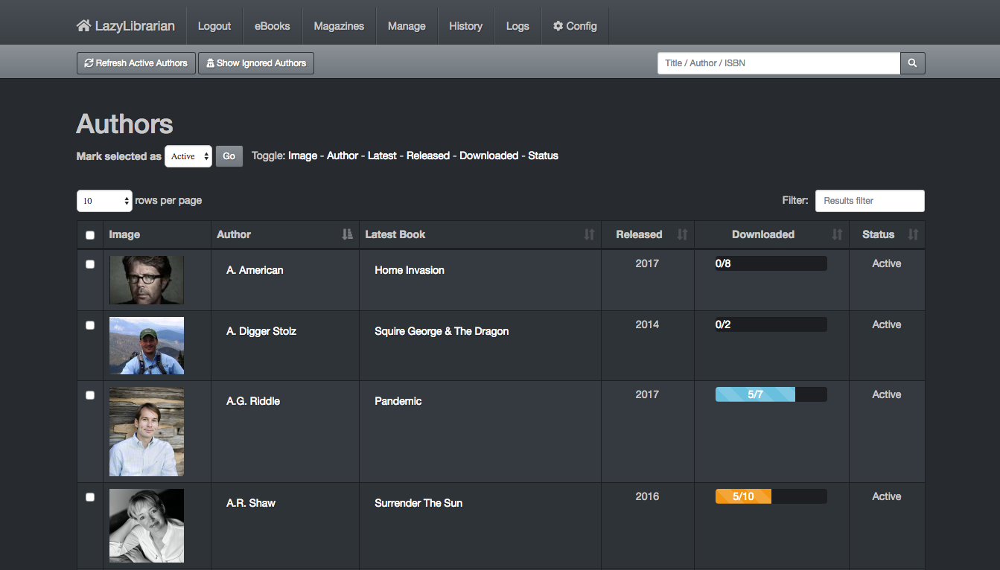
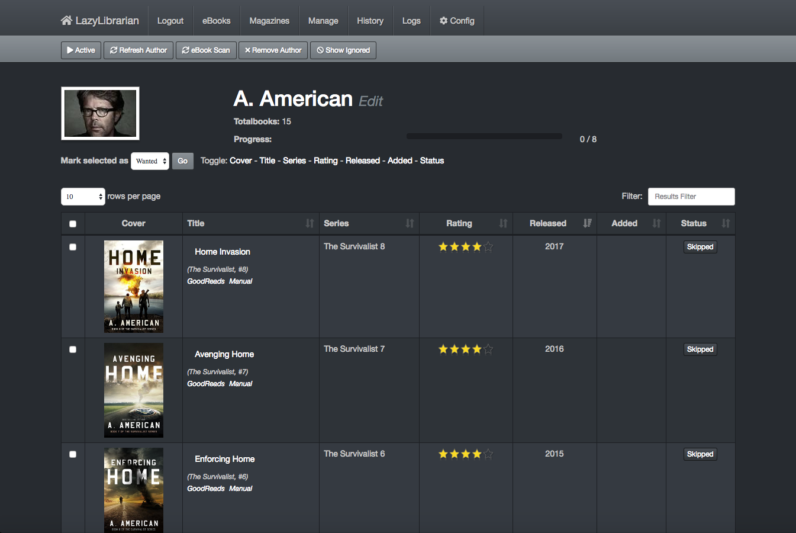
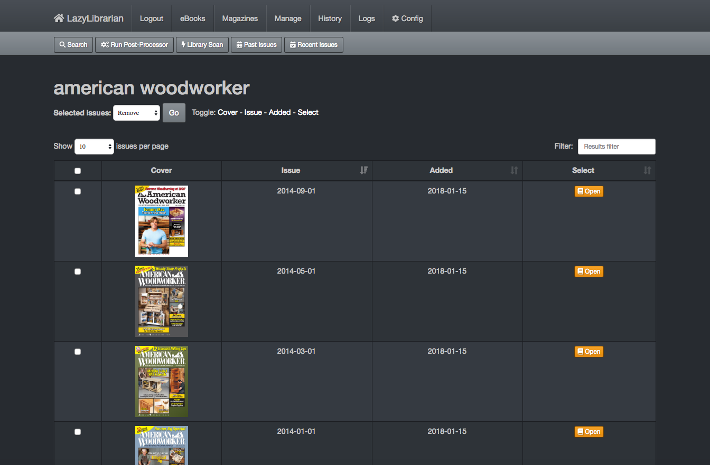

# LazyLibrarian

## Introduction

LazyLibrarian is a program to follow authors and grab metadata for all your digital reading needs.

It uses a combination of [Goodreads](https://www.goodreads.com/) [Librarything](https://www.librarything.com/) and optionally [GoogleBooks](https://www.googleapis.com/books/v1/) as sources for author info and book info. License: GNU GPL v3

Right now it's capable of the following:
* Import an existing calibre library (optional)
* Find authors and add them to the database
* List all books of an author and mark ebooks or audiobooks as 'wanted'.
* LazyLibrarian will search for a nzb-file or a torrent or magnet link for that book
* If a nzb/torrent/magnet is found it will be sent to a download client or saved in a black hole where your download client can pick it up.
* Currently supported download clients for usenet are :
   * sabnzbd (versions later than 0.7.x preferred)
   * nzbget
   * synology_downloadstation
* Currently supported download clients for torrent and magnets are:
   * deluge
   * transmission
   * utorrent
   * qbittorrent
   * rtorrent
   * synology_downloadstation
* When processing the downloaded books it will save a cover picture (if available) and save all metadata into metadata.opf next to the bookfile (calibre compatible format)
* The new theme for the site allows it to be accessed (and usable) from devices with a smaller screen (such as an iPad)
* AutoAdd feature for book management tools like Calibre which must have books in flattened directory structure, or use calibre to import your books into an existing calibre library
* LazyLibrarian can also be used to search for and download magazines, and monitor for new issues
* Offers opds interface for ebook clients to browse and download books.

## Screenshots

